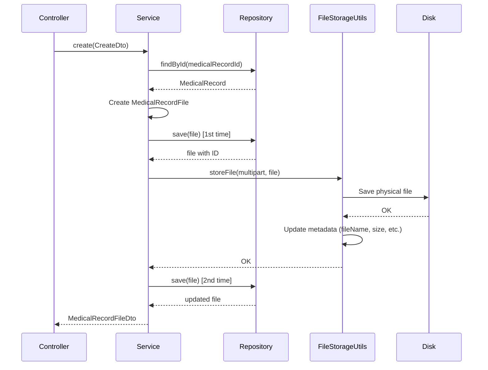
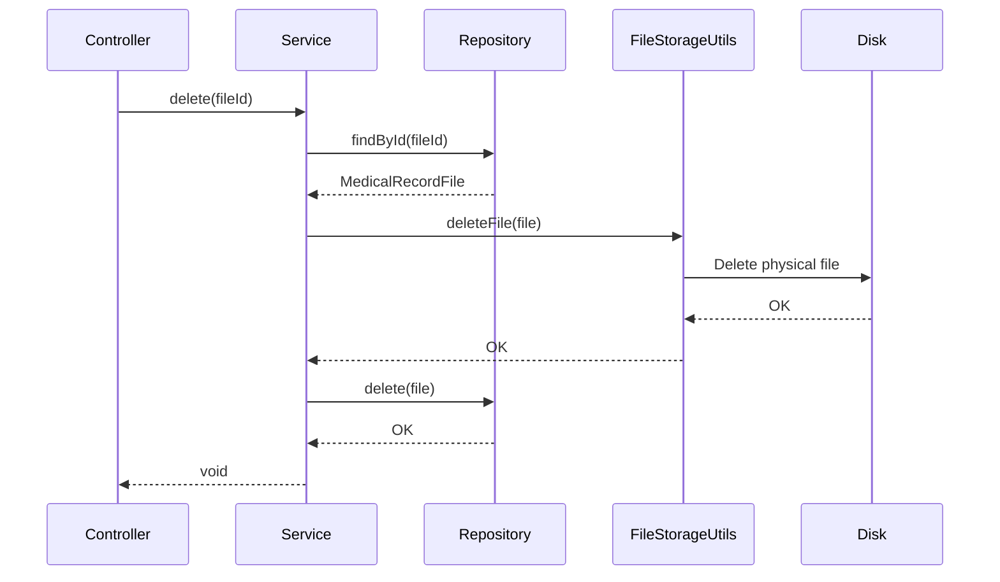

# 📁 CMED File System

## Overview

The CMED file system allows attaching documents, images, and videos to medical records and patient previous records. It uses an inheritance model with `BaseFile` as the base class and specializations for each entity type.

---

## 🏗️ Architecture

### Data Model

```
BaseFile (Table: base_files)
├── MedicalRecordFile (Discriminator: MEDICAL_RECORD)
└── PreviousRecordFile (Discriminator: PREVIOUS_RECORD)
```

**Single Table Inheritance:**
- All entities share the same table.

## 3. File Storage

### Location

Files are physically stored in the server's file system at a **configurable** location:

**Default path:** `~/cmed-files/`

**Configuration via environment variable:**
```bash
export FILE_STORAGE_PATH=/custom/path/files
```

**Configuration in `application.properties`:**
```properties
file.storage.path=${FILE_STORAGE_PATH:${user.home}/cmed-files}
```

This configuration allows:
- ✅ Using the `FILE_STORAGE_PATH` environment variable if defined
- ✅ Using `~/cmed-files` as the default value if not defined
- ✅ Different paths per environment (development, production, testing)

### Directory Structure

Files are organized by category:

```
${file.storage.path}/
├── document/
│   ├── 123e4567-e89b-12d3-a456-426614174000.pdf
│   └── 987fcdeb-51a2-43f1-b9c3-123456789abc.docx
├── image/
│   ├── 456e7890-a12b-34c5-d678-901234567def.jpg
│   └── 789abcde-f012-3456-7890-abcdef123456.png
└── video/
    └── abc12345-6789-0def-1234-567890abcdef.mp4
```

### File Naming

Files are renamed using their UUID + original extension:
- **Name in DB:** `originalName` (e.g., "Chest X-Ray.pdf")
- **Name on disk:** `fileName` (e.g., "123e4567-e89b-12d3-a456-426614174000.pdf")

### Size Limits

Configured in `application.properties`:

```properties
spring.servlet.multipart.max-file-size=50MB
spring.servlet.multipart.max-request-size=50MB
spring.servlet.multipart.file-size-threshold=2KB
```

- **Maximum file size:** 50MB
- **Maximum request size:** 50MB
- **Disk write threshold:** 2KB

---

## 📊 Models

### BaseFile

```java
@Entity
@Table(name = "base_files")
@Inheritance(strategy = InheritanceType.SINGLE_TABLE)
@DiscriminatorColumn(name = "entity_type")
public abstract class BaseFile {
    UUID id;
    LocalDateTime createdAt;
    LocalDateTime updatedAt;
    FileCategory category;      // IMAGE, VIDEO, DOCUMENT
    String fileName;             // {uuid}.{ext}
    String originalName;         // original file name
    String fileExtension;        // pdf, jpg, png, etc.
    Long fileSize;               // size in bytes
}
```

### MedicalRecordFile

```java
@Entity
@DiscriminatorValue("MEDICAL_RECORD")
public class MedicalRecordFile extends BaseFile {
    @ManyToOne
    MedicalRecord medicalRecord;
}
```

### PreviousRecordFile

```java
@Entity
@DiscriminatorValue("PREVIOUS_RECORD")
public class PreviousRecordFile extends BaseFile {
    @ManyToOne
    PreviousRecord previousRecord;
}
```

---

## 🔌 Endpoints

### Medical Record Files

#### List files of a medical record
```http
GET /api/medicalRecords/{medicalRecordId}/files
```

**Response:**
```json
[
  {
    "id": "550e8400-e29b-41d4-a716-446655440000",
    "createdAt": "2025-11-30T10:30:00",
    "updatedAt": "2025-11-30T10:30:00",
    "fileName": "550e8400-e29b-41d4-a716-446655440000.pdf",
    "originalName": "analysis_results.pdf",
    "fileExtension": "pdf",
    "fileSize": 245760,
    "category": "DOCUMENT",
    "medicalRecordId": "123e4567-e89b-12d3-a456-426614174000"
  }
]
```

#### Upload a file to a medical record
```http
POST /api/medicalRecords/{medicalRecordId}/files
Content-Type: multipart/form-data

file: [binary file]
```

**Response:** `201 Created`
```json
{
  "id": "550e8400-e29b-41d4-a716-446655440000",
  "fileName": "550e8400-e29b-41d4-a716-446655440000.pdf",
  "originalName": "analysis_results.pdf",
  "fileExtension": "pdf",
  "fileSize": 245760,
  "category": "DOCUMENT",
  "medicalRecordId": "123e4567-e89b-12d3-a456-426614174000"
}
```

#### Delete a file
```http
DELETE /api/medicalRecords/{medicalRecordId}/files/{fileId}
```

**Response:** `204 No Content`

---

### Previous Record Files

#### List files of a previous record
```http
GET /api/previousRecords/{previousRecordId}/files
```

#### Upload a file to a previous record
```http
POST /api/previousRecords/{previousRecordId}/files
Content-Type: multipart/form-data

file: [binary file]
```

#### Delete a file
```http
DELETE /api/previousRecords/{previousRecordId}/files/{fileId}
```

---

## 💻 Usage Examples

### Upload a file with curl

```bash
# Upload PDF to medical record
curl -X POST \
  http://localhost:8080/api/medicalRecords/123e4567-e89b-12d3-a456-426614174000/files \
  -F "file=@/path/to/document.pdf"

# Upload image to previous record
curl -X POST \
  http://localhost:8080/api/previousRecords/987e6543-e21b-12d3-a456-426614174000/files \
  -F "file=@/path/to/xray.jpg"
```

### List files

```bash
curl http://localhost:8080/api/medicalRecords/123e4567-e89b-12d3-a456-426614174000/files
```

### Delete a file

```bash
curl -X DELETE \
  http://localhost:8080/api/medicalRecords/123e4567-e89b-12d3-a456-426614174000/files/550e8400-e29b-41d4-a716-446655440000
```

---

## 🔧 Services

### FileStorageUtils

Utility for managing physical file storage:

```java
@Component
public class FileStorageUtils {
    // Save file to disk
    void storeFile(MultipartFile file, BaseFile baseFile);

    // Delete file from disk
    void deleteFile(BaseFile file);

    // Determine category by MIME type
    private FileCategory determineFileCategory(String contentType);
}
```

**Automatic categorization:**
- `image/*` → `FileCategory.IMAGE`
- `video/*` → `FileCategory.VIDEO`
- Others → `FileCategory.DOCUMENT`

### MedicalRecordFileService

```java
@Service
public class MedicalRecordFileService {
    List<MedicalRecordFileDto> getAllByMedicalRecordId(UUID medicalRecordId);
    MedicalRecordFileDto create(CreateMedicalRecordFileDto createDto);
    void delete(UUID fileId);
}
```

**Features:**
- Transactional: automatic rollback if storage fails
- Medical record existence validation
- Cascade deletion (DB + disk)

---

## 🧪 Tests

### Coverage

- **Controller Tests:** 6 tests (GET, POST, DELETE with success and error cases)
- **Service Tests:** 10 tests (creation, deletion, rollback, validations)
- **Total:** 16 tests ✅

### Run tests

```bash
cd /home/jcpicco/Documents/git/cmed-app/app
./gradlew test --tests "*File*"
```

### Test cases

- ✅ Upload valid file
- ✅ List files of a record
- ✅ Delete existing file
- ✅ Error when uploading without a file
- ✅ Error when deleting non-existent file
- ✅ Rollback when storage fails
- ✅ Error when medical record does not exist

---

## 🔒 Validations

### Backend

- **File required:** Cannot upload without a file
- **Record exists:** The medical/previous record must exist
- **Size:** No explicit limit (depends on Spring Boot config)
- **Extension:** Any extension allowed

### Spring Boot Configuration

To limit the maximum file size, add to `application.properties`:

```properties
spring.servlet.multipart.max-file-size=10MB
spring.servlet.multipart.max-request-size=10MB
```

---

## 🗄️ Database

### Table: base_files

```sql
CREATE TABLE base_files (
    id UUID PRIMARY KEY,
    entity_type VARCHAR(50) NOT NULL,  -- 'MEDICAL_RECORD' or 'PREVIOUS_RECORD'
    created_at TIMESTAMP NOT NULL,
    updated_at TIMESTAMP NOT NULL,
    category VARCHAR(20) NOT NULL,      -- 'IMAGE', 'VIDEO', 'DOCUMENT'
    file_name VARCHAR(255) NOT NULL,
    original_name VARCHAR(255) NOT NULL,
    file_extension VARCHAR(50) NOT NULL,
    file_size BIGINT,
    medical_record_id UUID,             -- FK to medical_records
    previous_record_id UUID             -- FK to previous_records
);
```

### Indexes

```sql
CREATE INDEX idx_medical_record_files ON base_files(medical_record_id);
CREATE INDEX idx_previous_record_files ON base_files(previous_record_id);
CREATE INDEX idx_entity_type ON base_files(entity_type);
```

---

## 🚨 Error Handling

### Custom Exceptions

- `FileStorageException`: Error saving/deleting file from disk
- `MedicalRecordFileNotFoundException`: File not found
- `PreviousRecordFileNotFoundException`: File not found
- `MedicalRecordNotFoundException`: Medical record does not exist
- `PreviousRecordNotFoundException`: Previous record does not exist

### HTTP Status Codes

- `200 OK`: Successful listing
- `201 Created`: File uploaded successfully
- `204 No Content`: File deleted successfully
- `400 Bad Request`: Missing or invalid file
- `404 Not Found`: File or record not found
- `500 Internal Server Error`: Storage error

---

## 📝 DTOs

### CreateMedicalRecordFileDto

```java
@Data
@Builder
public class CreateMedicalRecordFileDto {
    @NotNull
    private MultipartFile file;

    @NotNull
    @UUID
    private String medicalRecordId;
}
```

### MedicalRecordFileDto

```java
public record MedicalRecordFileDto(
    UUID id,
    LocalDateTime createdAt,
    LocalDateTime updatedAt,
    String fileName,
    String originalName,
    String fileExtension,
    Long fileSize,
    FileCategory category,
    UUID medicalRecordId
) {}
```

---

## 🔄 Upload Flow



**Note:** Saved twice because we need the generated UUID to create the file name.

---

## 🔄 Deletion Flow



---

## 🎯 Future Improvements

### Pending Features

1. **File download**
   - Endpoint: `GET /api/medicalRecords/{id}/files/{fileId}/download`
   - Return file with appropriate headers

2. **File type validation**
   - Whitelist of allowed extensions
   - Real MIME type validation (not just extension)

3. **Image compression**
   - Automatically generate thumbnails
   - Optimize large image sizes

4. **File search**
   - Filter by category
   - Search by original name
   - Sort by date/size

5. **Additional metadata**
   - File description
   - Tags/labels
   - User who uploaded the file

---

**Last updated:** 19-02-2026  
**Version:** 1.0.0  
**Developed by:** GitHub Copilot
